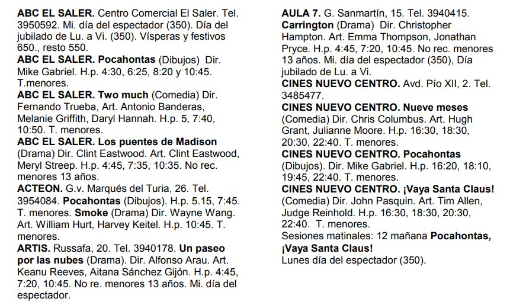
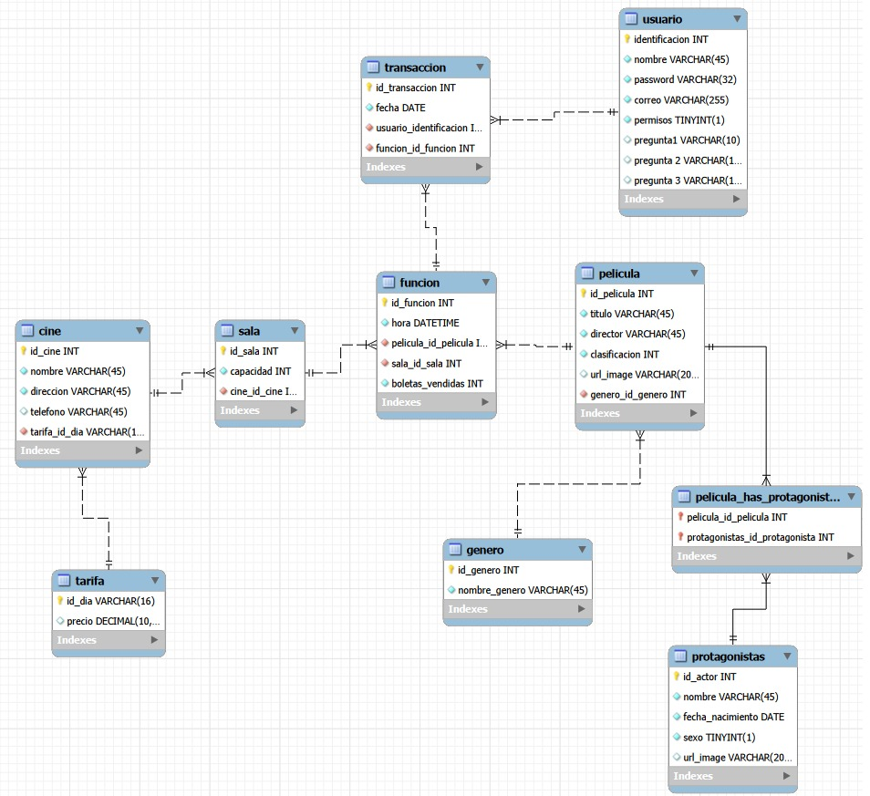

Este es un proyecto de la universidad que consiste en crear una aplicacion para internet de lo siguiente: 

- Enunciado
    
    La asociación de cines de una ciudad quiere crear un servicio telefónico en el que se pueda hacer cualquier tipo de consulta sobre las películas que se están proyectando actualmente: 
    
    - En qué cines hacen una determinada película 
    - El horario de los pases
    - Qué películas de dibujos animados se están proyectando y dónde
    - Qué películas hay en un determinado cine
    
    Para ello debemos diseñar una base de datos relacional que contenga toda esta información.
    En concreto, para cada cine:
    
    - Se debe dar el título de la película y el horario de las funciones, cada pelicula debe contener:
        - El nombre del director de la misma, el nombre de hasta tres de sus protagonistas
        - El género (comedia, intriga, etc.) 
        - La clasificación (tolerada menores, mayores de 18 años, etc.). 
    - La calle y número donde está el cine
    - El teléfono 
    - Los distintos precios según el día (día del espectador, día del jubilado, festivos y vísperas, carnet de estudiante, etc.).

    Hay que tener en cuenta:
    - Algunos cines tienen varias salas en las que se pasan distintas películas 
    - En un mismo cine se pueden pasar películas distintas en diferentes pases. 
    
    A continuación se muestra un ejemplo de la información que los cines proporcionarán al nuevo servicio telefónico.

    
    

Adicionalmente de esto nosotros vamos a hacer que dentroo de la interfaz las personas puedan reservar sus entradas y añadir obviamente un limite de compra
por funcion, a continuacion agregamos el modelo de la base de datos.

Por esto mismo nosotros nos dividiremos el trabajo

- Juan Rodriguez (JDRFdev): Se encargara de el frontend, usando bootstrap, sweetalert, tailwind entre otras, ademas de las validaciones.
- Santiago Tejero (TellMeT): Se encargara de el backend, es decir, bases de datos, crud y logica del negocio.

Asi mismo nosotros vimos que este proyecto nos puede servir para mostrar habilidades en campos especificos, por esto mismo el enfoque en mostrar
la division de trabajo.